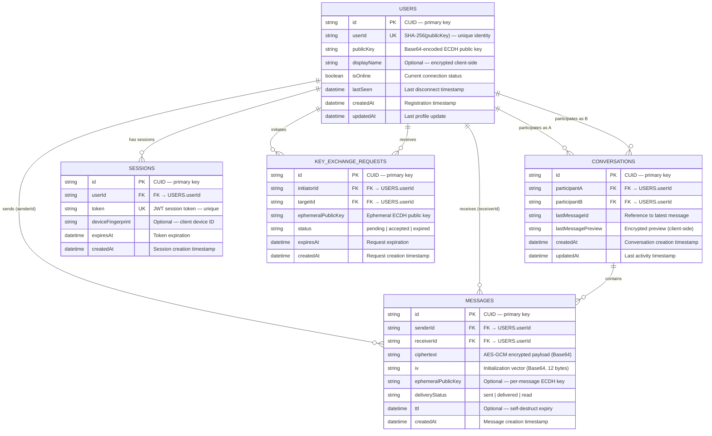

# ChatlockUP – ER Diagram

## Entity-Relationship Diagram

All tables store **ciphertext only** — no plaintext message content exists on the server.

---

## ER Diagram (Mermaid)

---

## Table Details

### USERS

| Column | Type | Constraints | Description |
|--------|------|-------------|-------------|
| `id` | string (CUID) | **PK** | Auto-generated primary key |
| `userId` | varchar(64) | **UNIQUE, NOT NULL** | `SHA-256(publicKey)` — cryptographic identity |
| `publicKey` | text | **NOT NULL** | Base64-encoded ECDH public key for key exchange |
| `displayName` | text | nullable | Optional name — encrypted on client before storage |
| `isOnline` | boolean | **NOT NULL, DEFAULT false** | WebSocket connection status |
| `lastSeen` | timestamp | nullable | Last disconnect time |
| `createdAt` | timestamp | **NOT NULL, DEFAULT now()** | Registration time |
| `updatedAt` | timestamp | **NOT NULL, DEFAULT now()** | Last update time |

**Indexes:**
- `userId` — unique index (primary lookup)
- `displayName` — text index (search)

---

### MESSAGES

| Column | Type | Constraints | Description |
|--------|------|-------------|-------------|
| `id` | string (CUID) | **PK** | Auto-generated primary key |
| `senderId` | varchar(64) | **FK → USERS.userId, NOT NULL** | Who sent the message |
| `receiverId` | varchar(64) | **FK → USERS.userId, NOT NULL** | Who receives the message |
| `ciphertext` | text | **NOT NULL** | AES-GCM encrypted content (Base64) |
| `iv` | varchar(32) | **NOT NULL** | Initialization vector — unique per message |
| `ephemeralPublicKey` | text | nullable | Per-message ECDH key (Phase 2 forward secrecy) |
| `deliveryStatus` | varchar(20) | **NOT NULL, DEFAULT "sent"** | `sent` / `delivered` / `read` |
| `ttl` | timestamp | nullable | Self-destruct time (optional) |
| `createdAt` | timestamp | **NOT NULL, DEFAULT now()** | Message timestamp |

**Indexes:**
- `idx_messages_sender` on `senderId`
- `idx_messages_receiver` on `receiverId`
- `idx_messages_conversation` on `(senderId, receiverId)` — composite
- `idx_messages_created_at` on `createdAt`

---

### CONVERSATIONS

| Column | Type | Constraints | Description |
|--------|------|-------------|-------------|
| `id` | string (CUID) | **PK** | Auto-generated primary key |
| `participantA` | varchar(64) | **FK → USERS.userId, NOT NULL** | First participant |
| `participantB` | varchar(64) | **FK → USERS.userId, NOT NULL** | Second participant |
| `lastMessageId` | text | nullable | ID of most recent message |
| `lastMessagePreview` | text | nullable | Encrypted preview (client-side encrypted) |
| `createdAt` | timestamp | **NOT NULL, DEFAULT now()** | Conversation start time |
| `updatedAt` | timestamp | **NOT NULL, DEFAULT now()** | Last activity time |

**Indexes:**
- `idx_conv_participant_a` on `participantA`
- `idx_conv_participant_b` on `participantB`

**Constraint:** Unique pair `(participantA, participantB)` — one conversation per user pair.

---

### SESSIONS

| Column | Type | Constraints | Description |
|--------|------|-------------|-------------|
| `id` | string (CUID) | **PK** | Auto-generated primary key |
| `userId` | varchar(64) | **FK → USERS.userId, NOT NULL** | Session owner |
| `token` | text | **UNIQUE, NOT NULL** | JWT token |
| `deviceFingerprint` | text | nullable | Client device identifier |
| `expiresAt` | timestamp | **NOT NULL** | Token expiration time |
| `createdAt` | timestamp | **NOT NULL, DEFAULT now()** | Session creation time |

**Indexes:**
- `token` — unique index (fast lookup)
- `userId` — index (find all sessions for a user)

---

### KEY_EXCHANGE_REQUESTS (Phase 2)

| Column | Type | Constraints | Description |
|--------|------|-------------|-------------|
| `id` | string (CUID) | **PK** | Auto-generated primary key |
| `initiatorId` | varchar(64) | **FK → USERS.userId, NOT NULL** | Who started the exchange |
| `targetId` | varchar(64) | **FK → USERS.userId, NOT NULL** | Target user |
| `ephemeralPublicKey` | text | **NOT NULL** | Temporary ECDH public key |
| `status` | varchar(20) | **NOT NULL, DEFAULT "pending"** | `pending` / `accepted` / `expired` |
| `expiresAt` | timestamp | **NOT NULL** | Exchange request expiry |
| `createdAt` | timestamp | **NOT NULL, DEFAULT now()** | Request creation time |

---

## Relationship Summary

| Relationship | Type | Description |
|-------------|------|-------------|
| USERS → MESSAGES | One-to-Many | A user sends many messages (`senderId`) |
| USERS → MESSAGES | One-to-Many | A user receives many messages (`receiverId`) |
| USERS → CONVERSATIONS | One-to-Many | A user participates in many conversations |
| USERS → SESSIONS | One-to-Many | A user can have multiple active sessions |
| USERS → KEY_EXCHANGE_REQUESTS | One-to-Many | A user can initiate/receive many key exchanges |
| CONVERSATIONS → MESSAGES | One-to-Many | A conversation contains many messages |

---

## Data Integrity Rules

| Rule | Implementation |
|------|----------------|
| No orphan messages | Foreign key on `senderId` and `receiverId` → `USERS.userId` |
| One conversation per pair | Unique constraint on sorted `(participantA, participantB)` |
| No plaintext stored | Application-level — all content encrypted client-side |
| Session cleanup | Periodic job deletes expired sessions |
| TTL messages | Background task removes messages past `ttl` timestamp |
| Cascading presence | On user delete → remove sessions, nullify messages (soft delete) |
