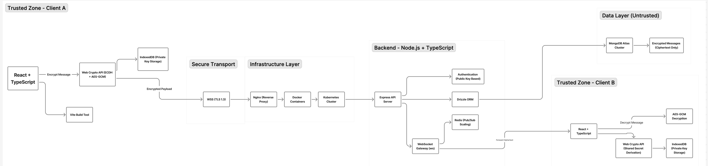

# ChatlockUP – System Architecture

Production-grade End-to-End Encrypted Chat Application  
Tech Stack: React (TS) + Node (TS) + MongoDB + Drizzle ORM

---

# 1️⃣ Architecture Overview

ChatlockUP follows a **client-side encryption model** where:

- Encryption & decryption happen only on client devices
- Server stores ciphertext only
- Identity is based on public-key cryptography
- Backend is untrusted regarding message content

---

# 2️⃣ High-Level Architecture Diagram

