# ChatlockUP – Class Diagram

## Major Classes & Relationships

This document describes the backend class structure following **OOP principles** and **clean architecture** (Controller → Service → Repository).

---

## Class Diagram (Mermaid)

```mermaid
classDiagram
    direction TB

    %% ──────────────────────────────────────
    %% CONTROLLERS
    %% ──────────────────────────────────────

    class BaseController {
        #req: Request
        #res: Response
        +handleRequest(req, res): void
        #sendSuccess(data, statusCode): Response
        #sendError(message, statusCode): Response
        #validateInput(schema, data): ValidationResult
    }

    class AuthController {
        -authService: AuthService
        +register(req, res): Promise~Response~
        +login(req, res): Promise~Response~
        +logout(req, res): Promise~Response~
        +getChallenge(req, res): Promise~Response~
    }

    class UserController {
        -userService: UserService
        +getPublicKey(req, res): Promise~Response~
        +searchUsers(req, res): Promise~Response~
        +getProfile(req, res): Promise~Response~
        +updateProfile(req, res): Promise~Response~
    }

    class MessageController {
        -messageService: MessageService
        +getConversationMessages(req, res): Promise~Response~
        +updateDeliveryStatus(req, res): Promise~Response~
    }

    class ConversationController {
        -conversationService: ConversationService
        +getConversations(req, res): Promise~Response~
        +getConversationById(req, res): Promise~Response~
    }

    %% ──────────────────────────────────────
    %% SERVICES (Business Logic)
    %% ──────────────────────────────────────

    class AuthService {
        -userRepository: UserRepository
        -sessionRepository: SessionRepository
        -tokenService: TokenService
        +register(userId, publicKey): Promise~AuthResult~
        +login(userId, signature, challenge): Promise~AuthResult~
        +logout(token): Promise~void~
        +generateChallenge(userId): Promise~string~
        -verifySignature(publicKey, signature, data): boolean
    }

    class UserService {
        -userRepository: UserRepository
        +getPublicKey(userId): Promise~string~
        +searchUsers(query): Promise~User[]~
        +getProfile(userId): Promise~User~
        +updateProfile(userId, data): Promise~User~
        +setOnlineStatus(userId, isOnline): Promise~void~
    }

    class MessageService {
        -messageRepository: MessageRepository
        -conversationService: ConversationService
        -deliveryStrategy: IDeliveryStrategy
        +sendMessage(senderId, receiverId, ciphertext, iv): Promise~Message~
        +getMessages(conversationId, pagination): Promise~Message[]~
        +updateStatus(messageId, status): Promise~void~
        +getPendingMessages(userId): Promise~Message[]~
        +deliverMessage(message): Promise~void~
    }

    class ConversationService {
        -conversationRepository: ConversationRepository
        +getConversations(userId): Promise~Conversation[]~
        +getOrCreateConversation(userA, userB): Promise~Conversation~
        +updateLastMessage(conversationId, messageId): Promise~void~
    }

    class TokenService {
        -secret: string
        -expiresIn: string
        +generateToken(payload): string
        +verifyToken(token): TokenPayload
        +decodeToken(token): TokenPayload
    }

    %% ──────────────────────────────────────
    %% REPOSITORIES (Data Access)
    %% ──────────────────────────────────────

    class IRepository~T~ {
        <<interface>>
        +findById(id: string): Promise~T~
        +findOne(filter: Partial~T~): Promise~T~
        +findMany(filter: Partial~T~): Promise~T[]~
        +create(data: Partial~T~): Promise~T~
        +update(id: string, data: Partial~T~): Promise~T~
        +delete(id: string): Promise~boolean~
    }

    class BaseRepository~T~ {
        <<abstract>>
        #db: DrizzleInstance
        #table: Table
        +findById(id): Promise~T~
        +findOne(filter): Promise~T~
        +findMany(filter): Promise~T[]~
        +create(data): Promise~T~
        +update(id, data): Promise~T~
        +delete(id): Promise~boolean~
    }

    class UserRepository {
        +findByUserId(userId): Promise~User~
        +findByPublicKey(publicKey): Promise~User~
        +searchByDisplayName(query): Promise~User[]~
        +updateOnlineStatus(userId, isOnline): Promise~void~
    }

    class MessageRepository {
        +findByConversation(senderid, receiverId, pagination): Promise~Message[]~
        +findPendingForUser(userId): Promise~Message[]~
        +updateDeliveryStatus(messageId, status): Promise~void~
        +bulkUpdateStatus(messageIds, status): Promise~void~
        +deleteExpired(): Promise~number~
    }

    class ConversationRepository {
        +findByParticipants(userA, userB): Promise~Conversation~
        +findByUserId(userId): Promise~Conversation[]~
        +updateLastMessage(conversationId, messageId, preview): Promise~void~
    }

    class SessionRepository {
        +findByToken(token): Promise~Session~
        +findByUserId(userId): Promise~Session[]~
        +deleteByToken(token): Promise~void~
        +deleteExpired(): Promise~number~
    }

    %% ──────────────────────────────────────
    %% WEBSOCKET
    %% ──────────────────────────────────────

    class WebSocketServer {
        -server: HTTPServer
        -connections: Map~string, WebSocket~
        -messageService: MessageService
        -userService: UserService
        -tokenService: TokenService
        +initialize(): void
        +handleConnection(ws, req): void
        +handleDisconnect(userId): void
        +sendToUser(userId, event, data): boolean
        +broadcastPresence(userId, status): void
        -authenticateConnection(req): TokenPayload
    }

    class WebSocketEventHandler {
        -messageService: MessageService
        -userService: UserService
        +onMessageSend(socket, payload): Promise~void~
        +onMessageAck(socket, payload): Promise~void~
        +onTypingStart(socket, payload): void
        +onTypingStop(socket, payload): void
    }

    %% ──────────────────────────────────────
    %% STRATEGY PATTERN (Message Delivery)
    %% ──────────────────────────────────────

    class IDeliveryStrategy {
        <<interface>>
        +deliver(message: Message, wsServer: WebSocketServer): Promise~DeliveryResult~
    }

    class OnlineDeliveryStrategy {
        +deliver(message, wsServer): Promise~DeliveryResult~
    }

    class OfflineDeliveryStrategy {
        -messageRepository: MessageRepository
        +deliver(message, wsServer): Promise~DeliveryResult~
    }

    class DeliveryStrategyFactory {
        -wsServer: WebSocketServer
        +getStrategy(receiverId): IDeliveryStrategy
    }

    %% ──────────────────────────────────────
    %% MIDDLEWARE
    %% ──────────────────────────────────────

    class AuthMiddleware {
        -tokenService: TokenService
        -sessionRepository: SessionRepository
        +authenticate(req, res, next): Promise~void~
        -extractToken(req): string
    }

    class RateLimiter {
        -windowMs: number
        -maxRequests: number
        -store: Map~string, RequestCount~
        +limit(req, res, next): void
    }

    class ErrorHandler {
        +handleError(err, req, res, next): void
        +notFound(req, res): void
    }

    %% ──────────────────────────────────────
    %% MODELS / TYPES
    %% ──────────────────────────────────────

    class User {
        +id: string
        +userId: string
        +publicKey: string
        +displayName: string?
        +isOnline: boolean
        +lastSeen: Date?
        +createdAt: Date
        +updatedAt: Date
    }

    class Message {
        +id: string
        +senderId: string
        +receiverId: string
        +ciphertext: string
        +iv: string
        +ephemeralPublicKey: string?
        +deliveryStatus: DeliveryStatus
        +ttl: Date?
        +createdAt: Date
    }

    class Conversation {
        +id: string
        +participantA: string
        +participantB: string
        +lastMessageId: string?
        +lastMessagePreview: string?
        +createdAt: Date
        +updatedAt: Date
    }

    class Session {
        +id: string
        +userId: string
        +token: string
        +deviceFingerprint: string?
        +expiresAt: Date
        +createdAt: Date
    }

    class DeliveryStatus {
        <<enumeration>>
        SENT
        DELIVERED
        READ
    }

    %% ──────────────────────────────────────
    %% RELATIONSHIPS
    %% ──────────────────────────────────────

    %% Inheritance
    AuthController --|> BaseController
    UserController --|> BaseController
    MessageController --|> BaseController
    ConversationController --|> BaseController

    UserRepository --|> BaseRepository
    MessageRepository --|> BaseRepository
    ConversationRepository --|> BaseRepository
    SessionRepository --|> BaseRepository

    BaseRepository ..|> IRepository

    OnlineDeliveryStrategy ..|> IDeliveryStrategy
    OfflineDeliveryStrategy ..|> IDeliveryStrategy

    %% Composition / Dependencies
    AuthController --> AuthService
    UserController --> UserService
    MessageController --> MessageService
    ConversationController --> ConversationService

    AuthService --> UserRepository
    AuthService --> SessionRepository
    AuthService --> TokenService

    UserService --> UserRepository

    MessageService --> MessageRepository
    MessageService --> ConversationService
    MessageService --> IDeliveryStrategy

    ConversationService --> ConversationRepository

    WebSocketServer --> WebSocketEventHandler
    WebSocketServer --> TokenService
    WebSocketEventHandler --> MessageService
    WebSocketEventHandler --> UserService

    DeliveryStrategyFactory --> WebSocketServer
    DeliveryStrategyFactory --> OnlineDeliveryStrategy
    DeliveryStrategyFactory --> OfflineDeliveryStrategy

    AuthMiddleware --> TokenService
    AuthMiddleware --> SessionRepository

    %% Model usage
    UserRepository --> User
    MessageRepository --> Message
    ConversationRepository --> Conversation
    SessionRepository --> Session
    Message --> DeliveryStatus
```



---

## OOP Principles Mapping

| Principle | Where It's Applied |
|-----------|-------------------|
| **Encapsulation** | Each layer (Controller/Service/Repository) exposes only its public interface. Private fields (e.g., `-authService`) are hidden. |
| **Abstraction** | `IRepository<T>` interface abstracts data access. `IDeliveryStrategy` abstracts delivery logic. Controllers don't know about DB. |
| **Inheritance** | `BaseController` provides shared HTTP response helpers. `BaseRepository<T>` provides generic CRUD. Concrete classes extend these. |
| **Polymorphism** | `IDeliveryStrategy` — `OnlineDeliveryStrategy` vs `OfflineDeliveryStrategy` selected at runtime by `DeliveryStrategyFactory`. |

---

## Design Patterns Used

| Pattern | Class(es) | Why |
|---------|-----------|-----|
| **Repository** | `BaseRepository`, `UserRepository`, `MessageRepository`, etc. | Decouples data access from business logic |
| **Strategy** | `IDeliveryStrategy`, `OnlineDeliveryStrategy`, `OfflineDeliveryStrategy` | Different delivery behavior based on recipient's online status |
| **Factory** | `DeliveryStrategyFactory` | Creates the correct delivery strategy at runtime |
| **Singleton** | `WebSocketServer`, DB connection | Single instance shared across the application |
| **Observer** | `WebSocketEventHandler` | Event-driven message handling (pub/sub for presence, typing) |
| **Template Method** | `BaseController.handleRequest()` | Defines skeleton for request handling, subclasses override specifics |

---

## Layer Dependency Flow

```
┌─────────────────────┐
│    Controllers       │  ← HTTP request entry point
│  (AuthController,    │
│   UserController,    │
│   MessageController) │
└─────────┬───────────┘
          │ depends on
          ▼
┌─────────────────────┐
│     Services         │  ← Business logic & orchestration
│  (AuthService,       │
│   UserService,       │
│   MessageService)    │
└─────────┬───────────┘
          │ depends on
          ▼
┌─────────────────────┐
│   Repositories       │  ← Data access (Drizzle ORM)
│  (UserRepository,    │
│   MessageRepository, │
│   SessionRepository) │
└─────────┬───────────┘
          │ queries
          ▼
┌─────────────────────┐
│     MongoDB          │  ← Database (ciphertext only)
└─────────────────────┘
```
