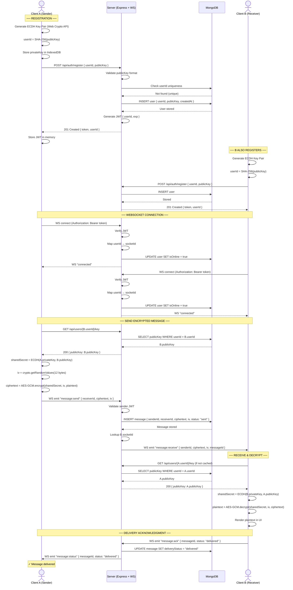
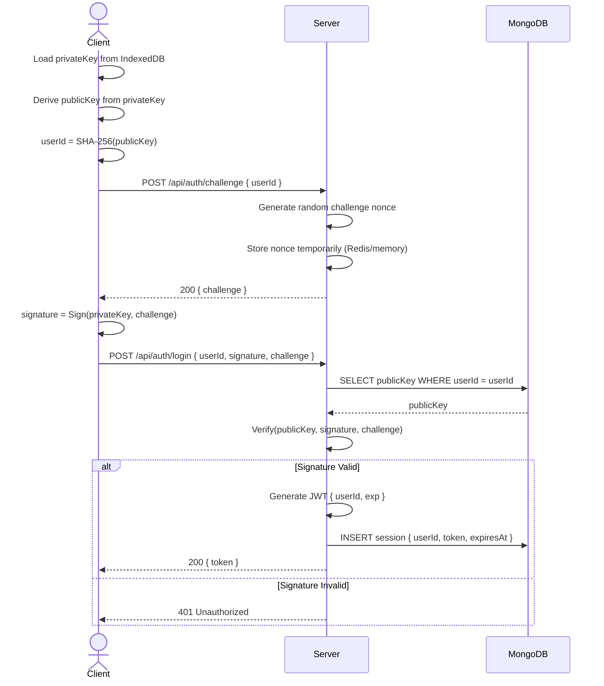
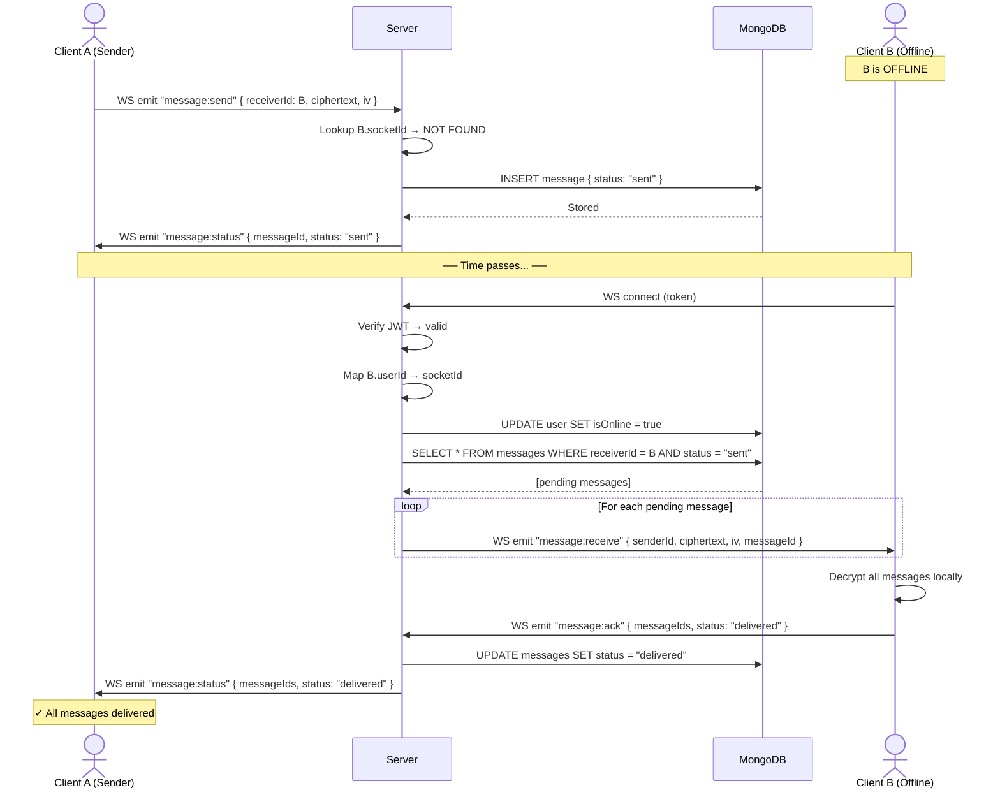
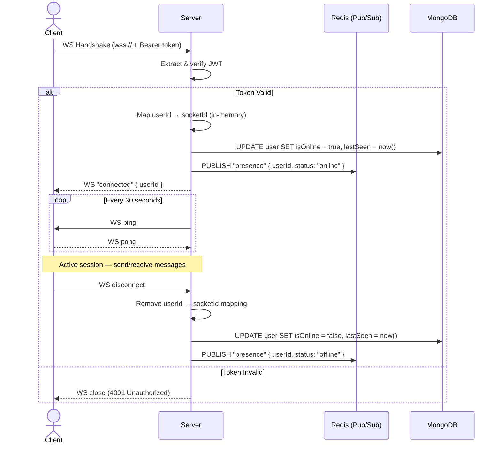
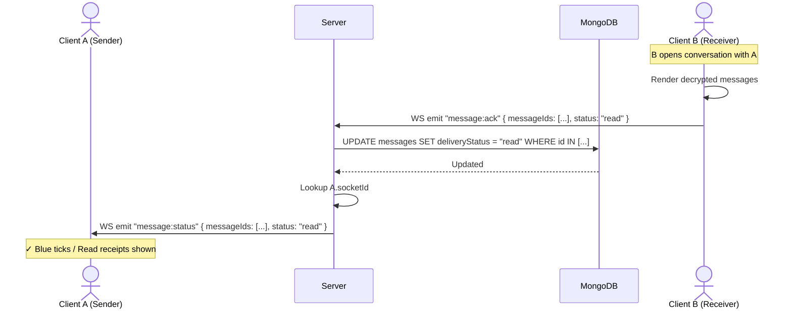

# ChatlockUP – Sequence Diagram

## Main Flow: End-to-End Encrypted Messaging

This document covers the **complete main flow** — from user registration through sending and receiving an encrypted message.

---

## 1. Complete Main Flow – Registration → Login → Send → Receive

---

## 2. Authentication Flow – Login with Signed Challenge

---

## 3. Offline Message Delivery Flow

---

## 4. WebSocket Connection Lifecycle

---

## 5. Read Receipt Flow

---

## Flow Summary

| # | Flow | Actors | Key Operations |
|---|------|--------|----------------|
| 1 | **Main Flow** | Sender, Server, DB, Receiver | Register → Connect WS → Encrypt → Send → Relay → Decrypt → ACK |
| 2 | **Login** | User, Server, DB | Challenge → Sign → Verify → JWT |
| 3 | **Offline Delivery** | Sender, Server, DB, Receiver | Store → Reconnect → Deliver pending → ACK |
| 4 | **WS Lifecycle** | Client, Server, Redis, DB | Handshake → Auth → Heartbeat → Disconnect |
| 5 | **Read Receipts** | Sender, Server, DB, Receiver | Open conversation → ACK "read" → Notify sender |
