# ChatlockUP – Use Case Diagram

---

## Actors

| Actor | Description |
|-------|-------------|
| **User (Sender)** | A registered user who sends encrypted messages |
| **User (Receiver)** | A registered user who receives and decrypts messages |
| **System (Server)** | Backend server — relays ciphertext, manages sessions, stores encrypted data |
| **Database (MongoDB)** | Persists users, encrypted messages, conversations, sessions |

---

## Use Case Diagram (Mermaid)

```mermaid
graph TB
    subgraph Actors
        U1["👤 User (Sender)"]
        U2["👤 User (Receiver)"]
        S["🖥️ Server"]
    end

    subgraph "Authentication Use Cases"
        UC1["Register with Key Pair"]
        UC2["Login via Signed Challenge"]
        UC3["Logout / End Session"]
    end

    subgraph "Messaging Use Cases"
        UC4["Send Encrypted Message"]
        UC5["Receive Encrypted Message"]
        UC6["View Conversation History"]
        UC7["Search Users"]
        UC8["View Delivery Status"]
        UC9["Send Typing Indicator"]
    end

    subgraph "Encryption Use Cases"
        UC10["Generate Key Pair"]
        UC11["Derive Shared Secret (ECDH)"]
        UC12["Encrypt Message (AES-GCM)"]
        UC13["Decrypt Message (AES-GCM)"]
        UC14["Fetch Recipient Public Key"]
    end

    subgraph "Server Use Cases"
        UC15["Relay Encrypted Message"]
        UC16["Store Ciphertext"]
        UC17["Deliver Offline Messages"]
        UC18["Manage WebSocket Connections"]
        UC19["Verify JWT Token"]
        UC20["Track Online/Offline Status"]
    end

    %% Sender interactions
    U1 --> UC1
    U1 --> UC2
    U1 --> UC3
    U1 --> UC4
    U1 --> UC6
    U1 --> UC7
    U1 --> UC8
    U1 --> UC9
    U1 --> UC10
    U1 --> UC11
    U1 --> UC12
    U1 --> UC14

    %% Receiver interactions
    U2 --> UC5
    U2 --> UC6
    U2 --> UC8
    U2 --> UC13
    U2 --> UC11

    %% Server interactions
    S --> UC15
    S --> UC16
    S --> UC17
    S --> UC18
    S --> UC19
    S --> UC20

    %% Dependencies (include relationships)
    UC4 -.->|includes| UC11
    UC4 -.->|includes| UC12
    UC4 -.->|includes| UC14
    UC5 -.->|includes| UC11
    UC5 -.->|includes| UC13
    UC1 -.->|includes| UC10
    UC2 -.->|includes| UC19
    UC15 -.->|includes| UC16
    UC17 -.->|extends| UC15
```

---

## Use Case Descriptions

### UC1: Register with Key Pair

| Field | Detail |
|-------|--------|
| **Actor** | User |
| **Precondition** | User does not have an account |
| **Flow** | 1. Client generates ECDH key pair → 2. Computes `userId = SHA-256(publicKey)` → 3. Sends `{ userId, publicKey }` to server → 4. Server validates and stores → 5. Returns JWT |
| **Postcondition** | User registered, JWT issued, private key stored in IndexedDB |

### UC2: Login via Signed Challenge

| Field | Detail |
|-------|--------|
| **Actor** | User |
| **Precondition** | User has private key in IndexedDB |
| **Flow** | 1. Client loads private key → 2. Signs a challenge → 3. Server verifies signature against stored public key → 4. Issues JWT |
| **Postcondition** | Authenticated session established |

### UC4: Send Encrypted Message

| Field | Detail |
|-------|--------|
| **Actor** | Sender |
| **Precondition** | Sender is authenticated and connected via WebSocket |
| **Flow** | 1. Fetch recipient's public key → 2. Derive shared secret (ECDH) → 3. Encrypt message (AES-GCM) → 4. Send `{ ciphertext, iv }` via WebSocket → 5. Server stores and relays |
| **Postcondition** | Ciphertext stored in DB, forwarded to recipient (or queued if offline) |

### UC5: Receive Encrypted Message

| Field | Detail |
|-------|--------|
| **Actor** | Receiver |
| **Precondition** | Receiver is authenticated |
| **Flow** | 1. Receive `{ ciphertext, iv }` via WebSocket → 2. Derive shared secret (ECDH) → 3. Decrypt using AES-GCM → 4. Render plaintext → 5. Send delivery ACK |
| **Postcondition** | Message displayed, delivery status updated |

### UC6: View Conversation History

| Field | Detail |
|-------|--------|
| **Actor** | User |
| **Precondition** | User is authenticated |
| **Flow** | 1. Request `GET /api/conversations/:id/messages` → 2. Server returns encrypted messages → 3. Client decrypts each message locally |
| **Postcondition** | Chat history displayed (decrypted client-side) |

### UC7: Search Users

| Field | Detail |
|-------|--------|
| **Actor** | User |
| **Precondition** | User is authenticated |
| **Flow** | 1. Enter search query → 2. `GET /api/users/search?q=` → 3. Server returns matching users (userId, displayName) |
| **Postcondition** | User list displayed, can initiate conversation |

### UC17: Deliver Offline Messages

| Field | Detail |
|-------|--------|
| **Actor** | Server |
| **Precondition** | Recipient reconnects via WebSocket |
| **Flow** | 1. Detect user connection → 2. Query pending messages with `status = "sent"` → 3. Forward all ciphertext → 4. Update status to `"delivered"` |
| **Postcondition** | All pending messages delivered, statuses updated |

---

## Use Case Summary Table

| # | Use Case | Actor | Priority |
|---|----------|-------|----------|
| UC1 | Register with Key Pair | User | Must Have |
| UC2 | Login via Signed Challenge | User | Must Have |
| UC3 | Logout / End Session | User | Must Have |
| UC4 | Send Encrypted Message | Sender | Must Have |
| UC5 | Receive Encrypted Message | Receiver | Must Have |
| UC6 | View Conversation History | User | Must Have |
| UC7 | Search Users | User | Should Have |
| UC8 | View Delivery Status | User | Should Have |
| UC9 | Send Typing Indicator | User | Nice to Have |
| UC10 | Generate Key Pair | User (client) | Must Have |
| UC11 | Derive Shared Secret | User (client) | Must Have |
| UC12 | Encrypt Message | Sender (client) | Must Have |
| UC13 | Decrypt Message | Receiver (client) | Must Have |
| UC14 | Fetch Recipient Public Key | Sender | Must Have |
| UC15 | Relay Encrypted Message | Server | Must Have |
| UC16 | Store Ciphertext | Server | Must Have |
| UC17 | Deliver Offline Messages | Server | Must Have |
| UC18 | Manage WebSocket Connections | Server | Must Have |
| UC19 | Verify JWT Token | Server | Must Have |
| UC20 | Track Online/Offline Status | Server | Should Have |
